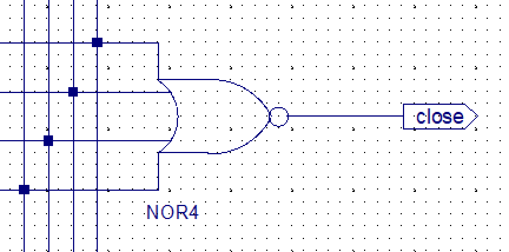
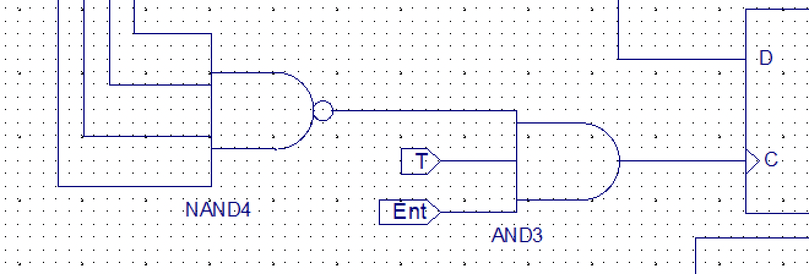
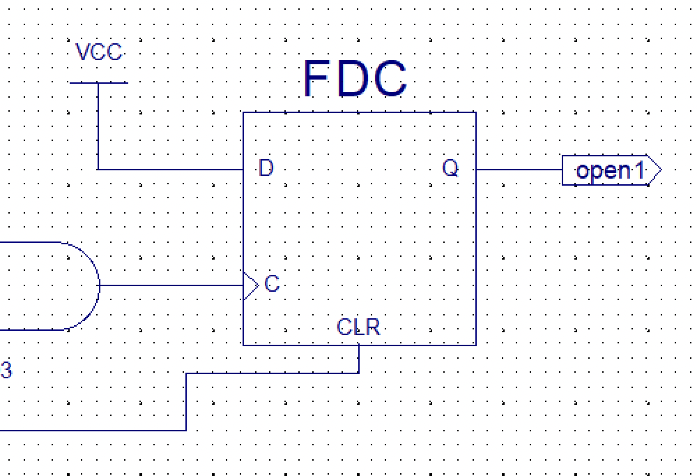
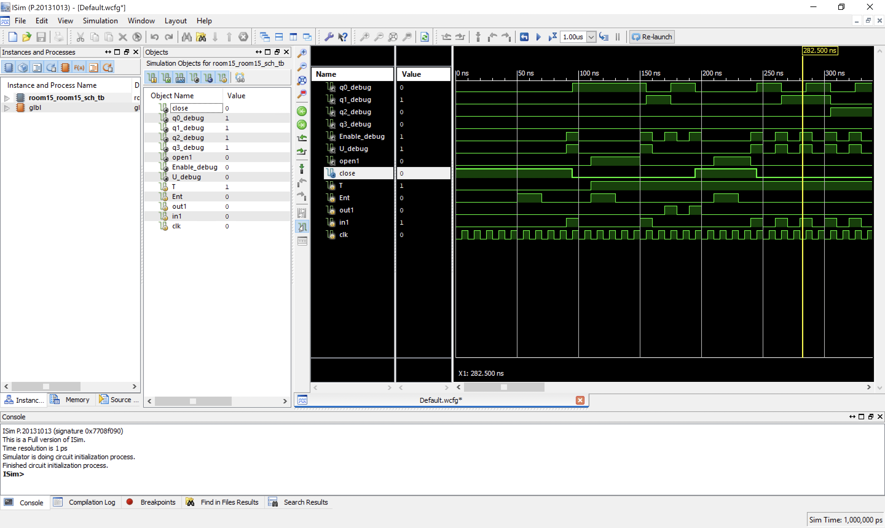

# گزارش آزمایش ۲ - آزمایشگاه طراحی سیستم‌های دیجیتال
> Alireza Habibzadeh `99109393`

## پیاده‌سازی شمارنده
برای پیاده‌سازی شمارنده از فلیپ‌فلاپ‌های T به صورت سنکرون استفاده می‌کنیم. برای تعیین T این فلیپ‌فلاپ‌ها کافی است از `AND` خروجی‌های فلیپ‌فلاپ‌های قبلی در نمایش بیتی استفاده کنیم. برای وقتی که شمارش رو به پایین است (`U = 0`)، باید `NOT` خروجی‌ها را در محاسبات شرکت دهیم. برای این کار خروجی‌ها را با (وارونِ)
`XOR`
U
می‌کنیم.
تصویری از مدار نهایی در صفحه‌ی بعد آمده است.

> 
>
> close signal


> 
>
> open signal (not latched)

> 
>
> open signal (latched) (CLR = in1)

> 
>
> simulation window

```verilog
always #5 clk = ~clk;
```

| IN | OUT | U | Enable |
|----|-----|---|--------|
| 0  | 0   | 0 | 0      |
| 0  | 1   | 0 | 1      |
| 1  | 0   | 1 | 1      |
| 1  | 1   | 0 | 0      |

```verilog
always #5 clk = ~clk;
	
initial begin
	T = 0;
	Ent = 0;
	out1 = 0;
	in1 = 0;
	clk = 0;
	#50
	
	Ent = 1; #20 Ent = 0; #20
	in1 = 1; #10 in1 = 0; #10
	
	T = 1;
	Ent = 1; #20 Ent = 0; #20;
	in1 = 1; #10 in1 = 0; #10;
	
	out1 = 1; #10 out1 = 0; #10;
	
	out1 = 1; #10 out1 = 0; #10;
	
	Ent = 1; #20 Ent = 0;
	#10 in1 = 1; #10 in1 = 0;
	#10 in1 = 1; #10 in1 = 0;
	#10 in1 = 1; #10 in1 = 0;
	#10 in1 = 1; #10 in1 = 0;
	#10 in1 = 1; #10 in1 = 0;
	#10 in1 = 1; #10 in1 = 0;
	#10 in1 = 1; #10 in1 = 0;
	#10 in1 = 1; #10 in1 = 0;
	#10 in1 = 1; #10 in1 = 0;
	#10 in1 = 1; #10 in1 = 0;
	#10 in1 = 1; #10 in1 = 0;
	#10 in1 = 1; #10 in1 = 0;
	#10 in1 = 1; #10 in1 = 0;
	#10 in1 = 1; #10 in1 = 0;
	#10 in1 = 1; #10 in1 = 0;
	
	#20 Ent = 1; #20 Ent = 0;
	
end
```
